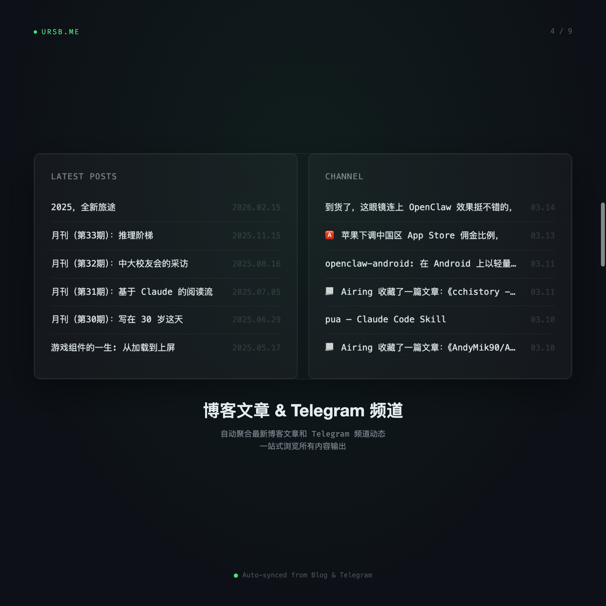
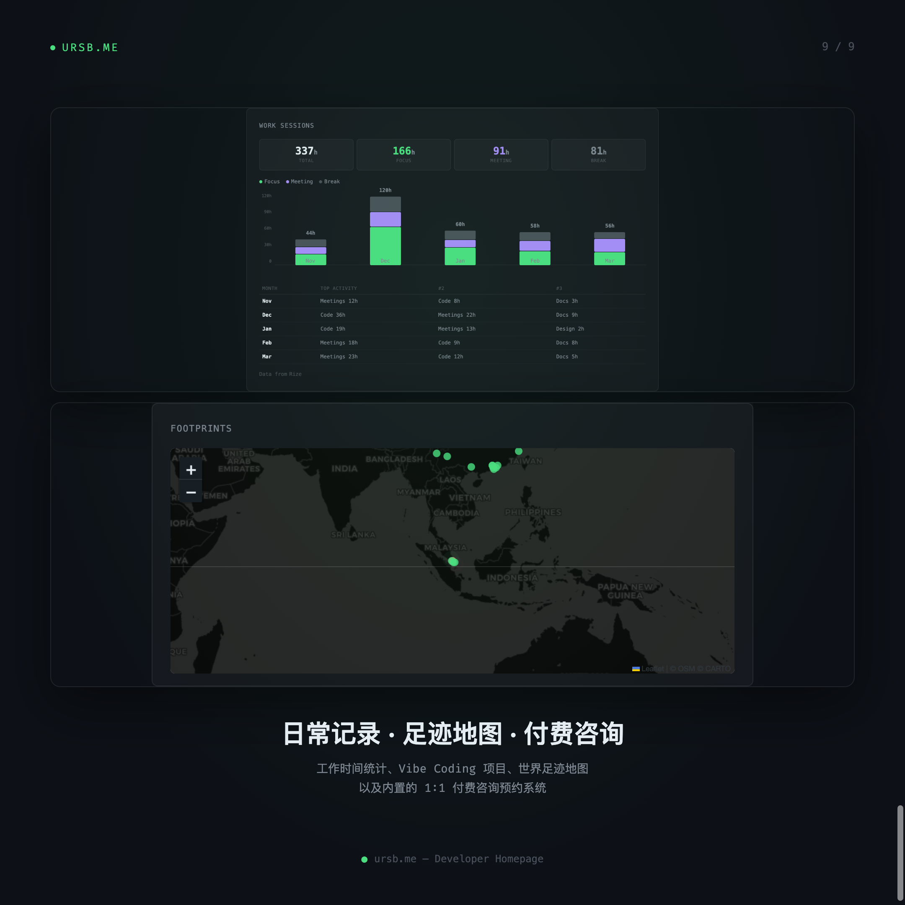

# ursb.me

A data-driven developer homepage that displays my digital life in real-time.

Built with vanilla HTML / CSS / JS. No framework. Single file.

## Features

<table>
  <tr>
    <td align="center"> <b>Overview</b></td>
    <td align="center"> <b>AI Chat</b></td>
    <td align="center"> <b>GitHub & Skills</b></td>
  </tr>
  <tr>
    <td align="center"> <b>Blog & Channel</b></td>
    <td align="center"> <b>Music & Now Playing</b></td>
    <td align="center"> <b>Douban Reading & Movies</b></td>
  </tr>
  <tr>
    <td align="center"> <b>Mood & Activity</b></td>
    <td align="center"> <b>Highlights & Software</b></td>
    <td align="center"> <b>Sessions & Map</b></td>
  </tr>
</table>

- **AI Chat** — Visitors can chat with an LLM-powered "me" to learn about my work and interests
- **GitHub Heatmap & Stats** — Real-time contribution data, skill tree, and project showcase
- **Blog & Telegram Channel** — Auto-synced latest posts and channel updates
- **Last.fm Music & Now Playing** — Live listening status and historical scrobble statistics
- **Douban Reading & Movies** — Terminal-style book and movie records with ratings
- **Mood & Activity** — Daily mood tracking and Apple Health fitness data
- **Readwise Highlights** — 4000+ reading highlights displayed randomly
- **Software Stack** — Curated list of daily tools across productivity, dev, AI, and more
- **World Map** — Interactive footprint map of visited cities and countries
- **1:1 Consultation** — Built-in booking system for paid personal growth sessions
- **i18n** — Full English / Chinese language toggle

## Data Sources

| Source | Data |
|--------|------|
| GitHub | Contribution heatmap, repos, followers |
| Last.fm | Scrobbles, now playing, top artists |
| Douban | Books read/reading, movies watched/watching |
| Readwise | Reading highlights and annotations |
| Telegram | Channel posts via Bot API |
| Raindrop | Bookmarks and saved articles |
| Rize | Work session time tracking |
| DayOne | Mood journal entries |
| Apple Health | Activity rings, steps, heart rate, sleep |

## Tech Stack

- Single `index.html` file (~6000 lines)
- Vanilla HTML / CSS / JavaScript
- No build step, no bundler, no framework
- GitHub Actions for daily data refresh and deployment
- Deployed to GitHub Pages + Aliyun

## License

MIT
