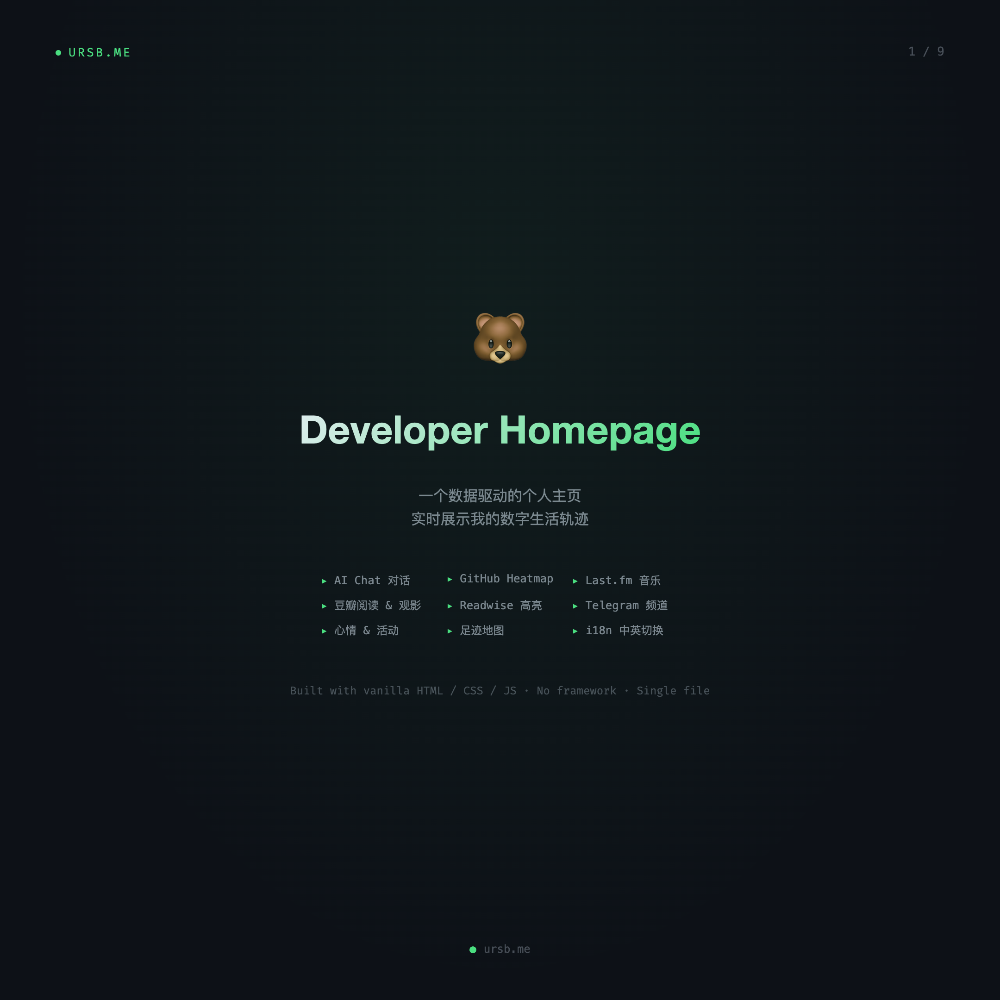
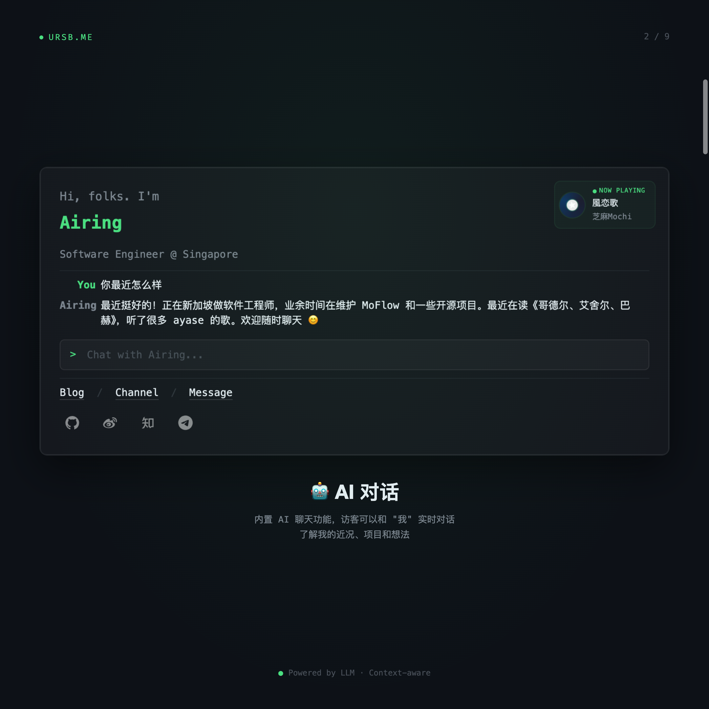
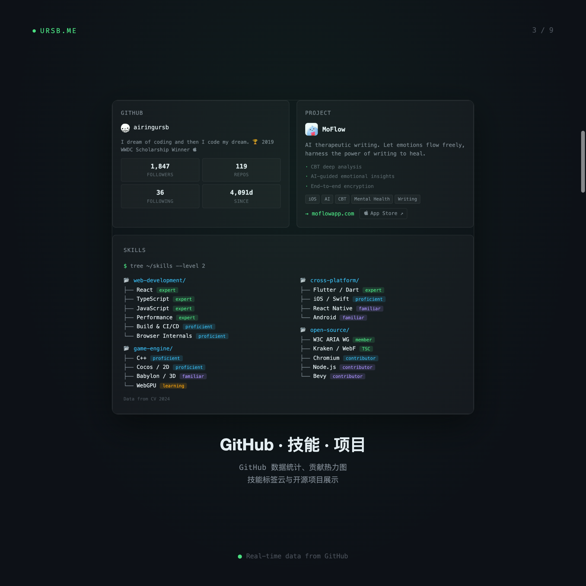
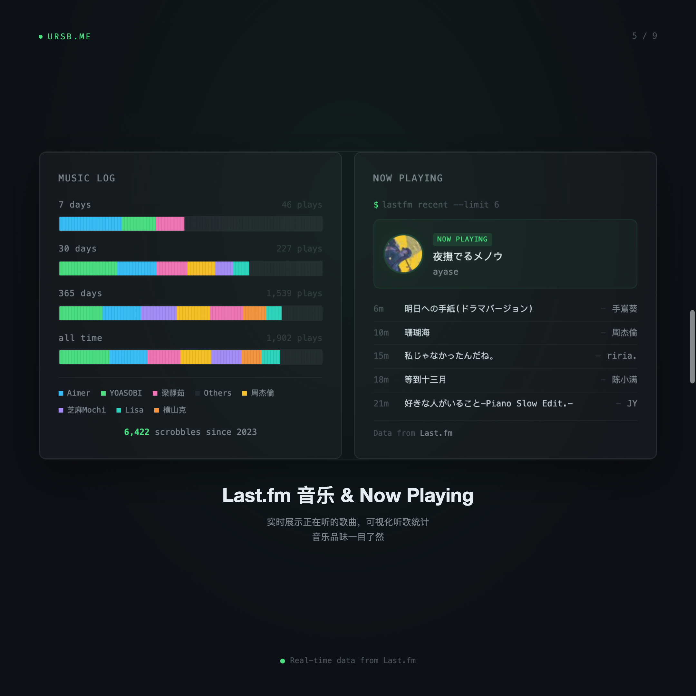
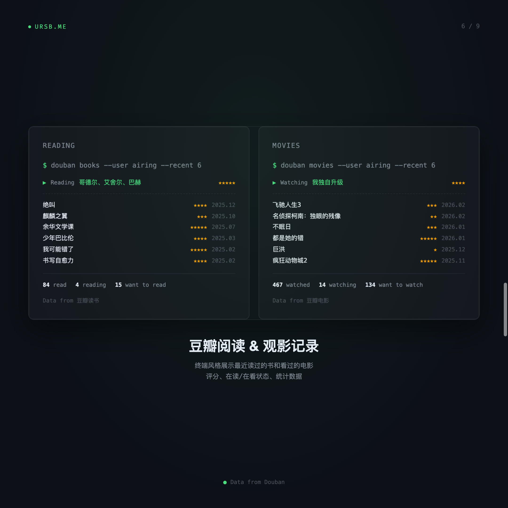
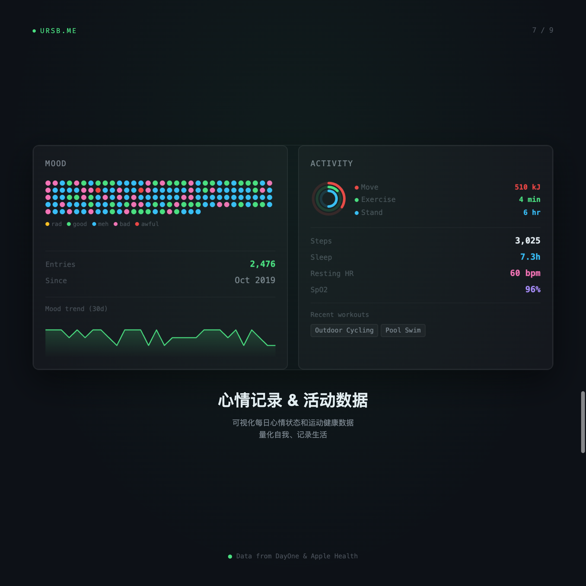
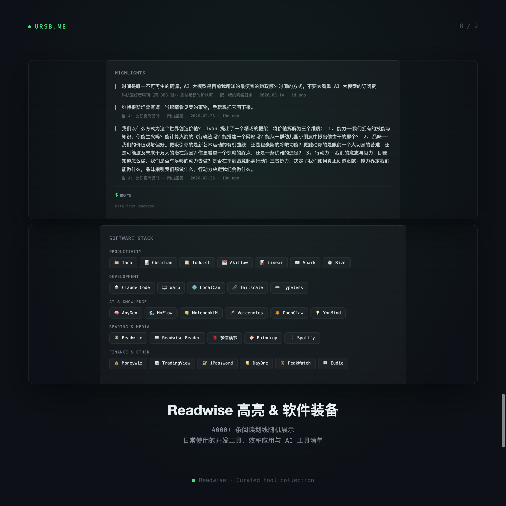

# ursb.me

A data-driven developer homepage that displays my digital life in real-time.

Built with Astro + vanilla HTML / CSS / JS.

## Features

<table>
  <tr>
    <td align="center"><br><b>Overview</b></td>
    <td align="center"><br><b>AI Chat</b></td>
    <td align="center"><br><b>GitHub & Skills</b></td>
  </tr>
  <tr>
    <td align="center"><br><b>Blog & Channel</b></td>
    <td align="center"><br><b>Music & Now Playing</b></td>
    <td align="center"><br><b>Douban Reading & Movies</b></td>
  </tr>
  <tr>
    <td align="center"><br><b>Mood & Activity</b></td>
    <td align="center"><br><b>Highlights & Software</b></td>
    <td align="center"><br><b>Sessions & Map</b></td>
  </tr>
</table>

- **AI Chat** — Visitors can chat with an LLM-powered "me" to learn about my work and interests
- **GitHub Heatmap & Stats** — Real-time contribution data, skill tree, and project showcase
- **Blog & Telegram Channel** — Auto-synced latest posts and channel updates
- **Last.fm Music & Now Playing** — Live listening status and historical scrobble statistics
- **Douban Reading & Movies** — Terminal-style book and movie records with ratings
- **Mood & Activity** — Daily mood tracking and Apple Health fitness data
- **Readwise Highlights** — 4000+ reading highlights displayed randomly
- **Software Stack** — Curated list of daily tools across productivity, dev, AI, and more
- **World Map** — Interactive footprint map of visited cities and countries
- **1:1 Consultation** — Built-in booking system for paid personal growth sessions
- **i18n** — Full English / Chinese language toggle

## Data Sources

| Source | Data |
|--------|------|
| GitHub | Contribution heatmap, repos, followers |
| Last.fm | Scrobbles, now playing, top artists |
| Douban | Books read/reading, movies watched/watching |
| Readwise | Reading highlights and annotations |
| Telegram | Channel posts via Bot API |
| Raindrop | Bookmarks and saved articles |
| Rize | Work session time tracking |
| DayOne | Mood journal entries |
| Apple Health | Activity rings, steps, heart rate, sleep |

## Tech Stack

- **Framework**: [Astro](https://astro.build/) with blog content collections
- **Homepage**: Single `index.html` with CI-injected live data
- **Backend**: Chat middleware + OpenClaw gateway ([private repo](https://github.com/airingursb/blog-server))
- **CI/CD**: GitHub Actions — daily data refresh, Astro build, deploy
- **Hosting**: GitHub Pages + Aliyun server (rsync over SSH)
- **Database**: Supabase (visitor stats, chat messages, comments, subscriptions)

## Project Structure

```
.
├── src/                  # Astro source (layouts, pages, content collections)
├── public/               # Static assets served as-is
├── scripts/              # Data pipeline (Python/Shell)
│   ├── update_feed.py    # CI: aggregate blog, Telegram, Last.fm, etc.
│   ├── collect_local_data.py  # Local: Apple Health, Claude usage, mood
│   └── fetch_douban.py   # Local: Douban books & movies
├── data/                 # Local data files (douban, health, etc.)
├── services/             # Git submodule → airingursb/blog-server (private)
├── index.html            # Homepage template (CI injects live data)
└── .github/workflows/    # CI/CD pipelines
```

## License

MIT
